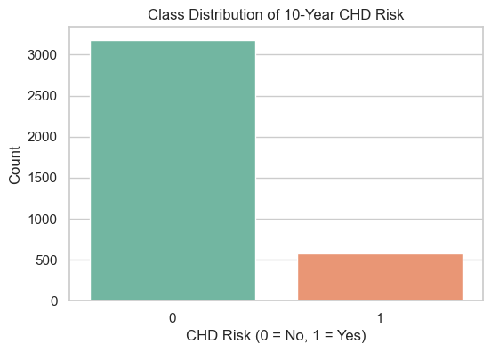
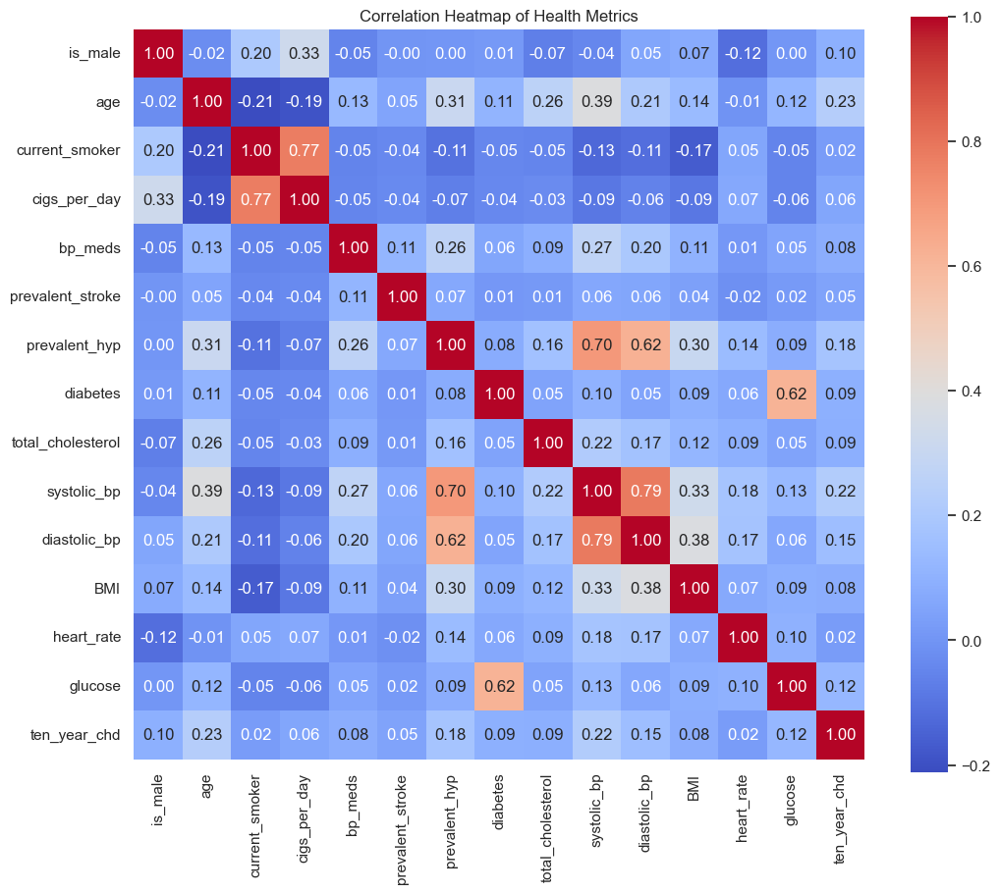
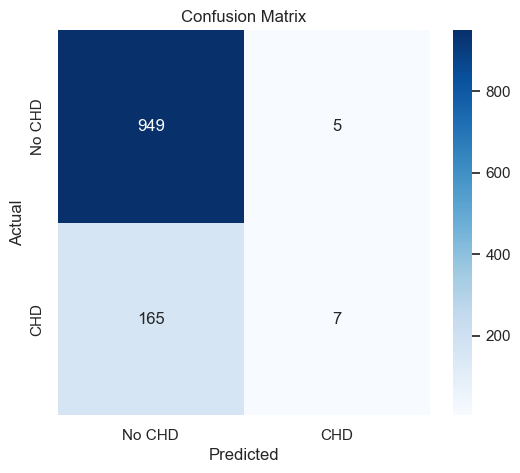
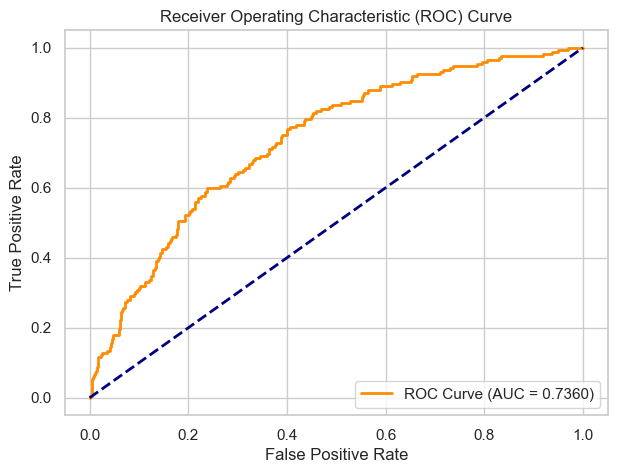

# Heart Disease Prediction Using Logistic Regression

## Project Overview
This project uses a Logistic Regression model to predict whether a patient has a 10-year risk of developing Coronary Heart Disease (CHD). The model is trained on the clinical Framingham Heart Study dataset, which tracks key patient health indicators.

## Key Accomplishments
* **Data Cleaning & Preprocessing:** Removed irrelevant columns, handled missing values, split the dataset into training and testing sets, and scaled clinical data for accurate model training.
* **Exploratory Data Analysis (EDA):** Generated clear visualizations to map out correlation patterns between metrics and analyze target class distributions.
* **Model Evaluation:** Achieved a complete performance breakdown by generating a Confusion Matrix, measuring precision and recall, and mapping out an ROC-AUC curve.

## Repository Contents
* [**data/**](https://github.com/LishaJane23/heart-disease-prediction/tree/main/data): Contains the patient dataset (`framingham.csv`).
* [**notebooks/**](https://github.com/LishaJane23/heart-disease-prediction/tree/main/notebooks): Contains the complete, runnable Python code (`exploration_and_modeling.ipynb`).
* [**outputs/**](https://github.com/LishaJane23/heart-disease-prediction/tree/main/outputs): Contains the four generated charts and model evaluation graphs.

## Core Results & Visualizations
The model successfully maps out patient risk probability. Below are the visual assets generated during runtime:

### Class Distribution

### Correlation Heatmap

### Confusion Matrix

### ROC-AUC Curve

## Future Scope
* Implement Ensemble Methods (e.g., Random Forest, XGBoost) to optimize predictive recall.
* Apply class imbalance correction techniques (like SMOTE) to improve sensitivity on high-risk patient profiles.
